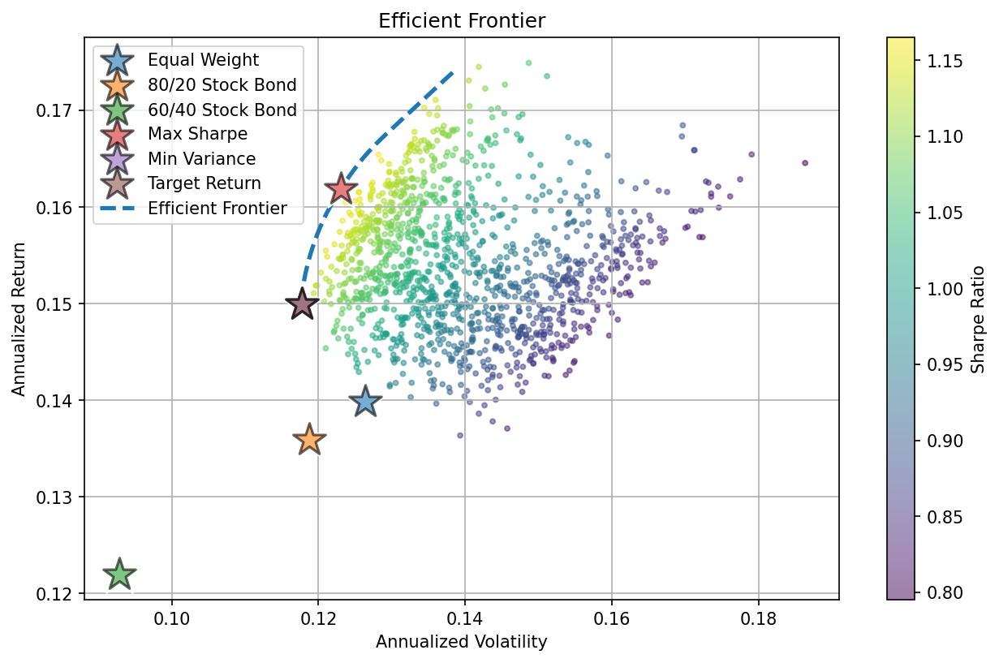
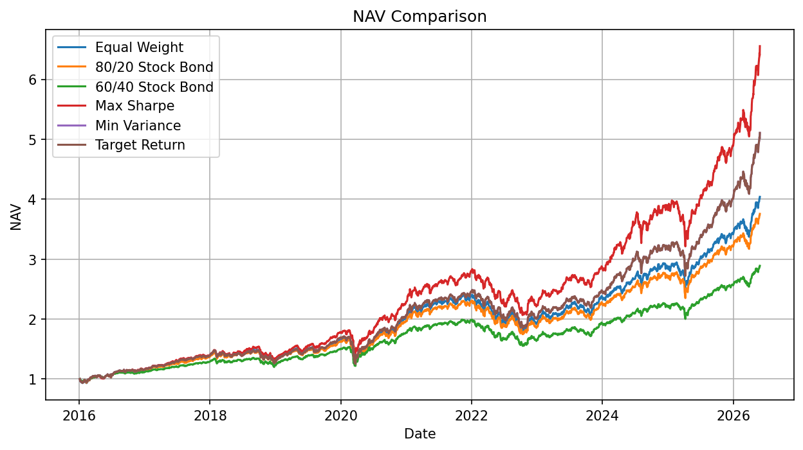
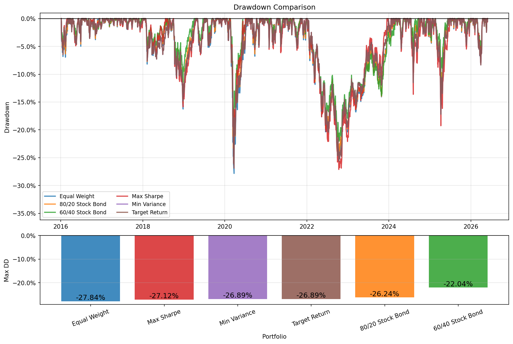
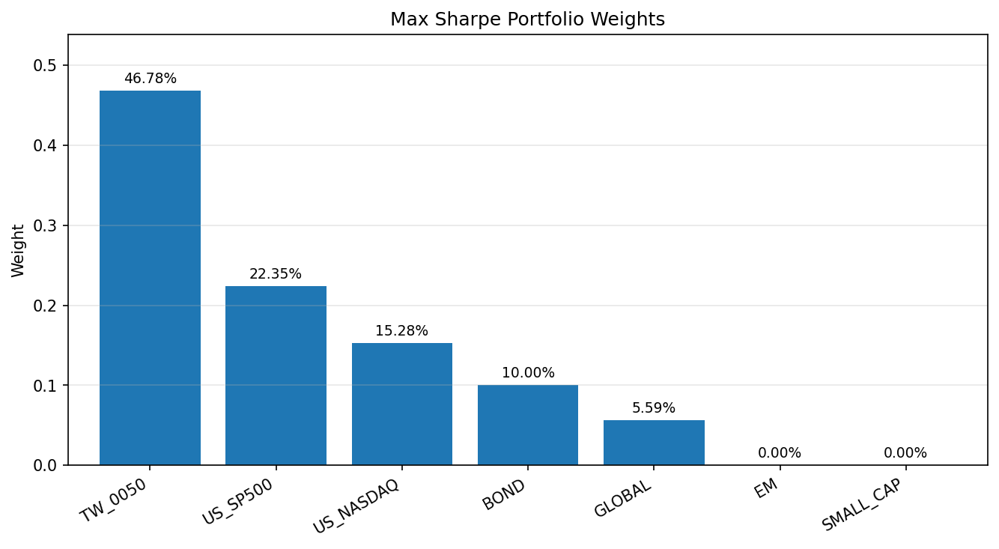
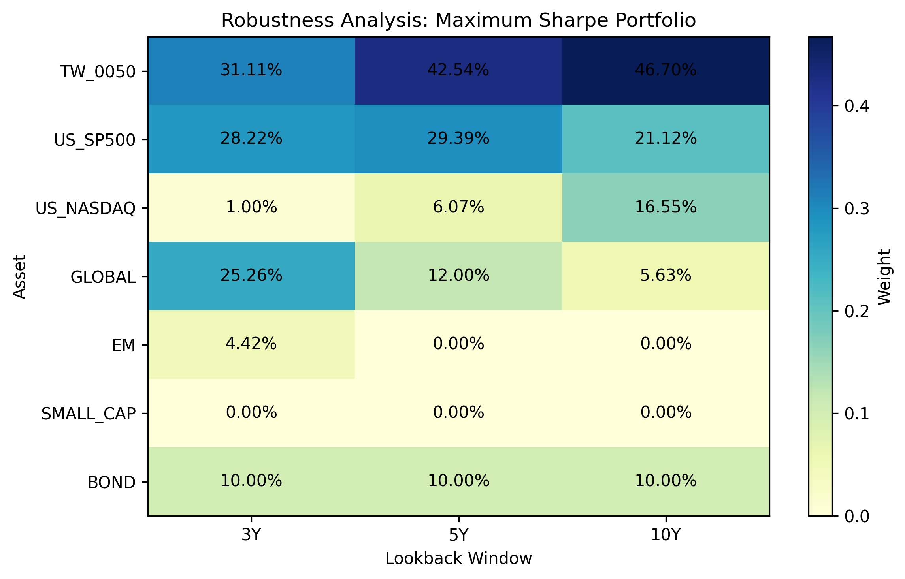

# Robust Portfolio Optimization

A robust mean-variance optimization framework for constructing long-only ETF portfolios.

This project investigates whether portfolio optimization can improve risk-adjusted performance while maintaining stable portfolio characteristics across different historical estimation windows.

---

## Overview

Traditional mean-variance optimization is highly sensitive to estimation error.

To mitigate this issue, this project incorporates shrinkage estimators for expected returns and covariance matrices and evaluates robustness through rolling lookback analyses.

The framework constructs and compares:

- Maximum Sharpe portfolio
- Minimum Variance portfolio
- Target Return (minimum-variance) portfolio

against several benchmark allocations, including:

- Equal Weight
- 80/20 Stock-Bond
- 60/40 Stock-Bond

---

## ETF Universe

| Asset | ETF |
|--------|-----|
| Taiwan Equity | 0050.TW |
| U.S. Equity | SPY |
| U.S. Nasdaq | QQQ |
| Global Equity | VT |
| Emerging Markets | VWO |
| Small Cap | IJR |
| Bonds | BND |

Sample period:

```
2016-01-01 ~ 2026-05-31
```

---

## Methodology

1. Download historical ETF prices from Yahoo Finance.

2. Estimate expected returns and covariance matrices using shrinkage estimators.

3. Generate candidate portfolios under long-only allocation constraints.

4. Construct:

   - Maximum Sharpe portfolio
   - Minimum Variance portfolio
   - Target Return portfolio

5. Compare optimized portfolios with benchmark allocations.

6. Evaluate robustness using different lookback windows:

   - 3 years
   - 5 years
   - 10 years

---

## Efficient Frontier


<p align="center">
  
</p>

The optimized portfolios lie closer to the efficient frontier than benchmark allocations, indicating improved risk-return efficiency under the current model assumptions.


### Observation

The target-return portfolio was constructed using a minimum-volatility objective with a return floor of 12%.

In this dataset, the minimum-variance portfolio already achieved an expected return above 12%, making the return constraint non-binding.

As a result, the Target Return portfolio became nearly identical to the Minimum Variance portfolio and appears very close to it on the efficient frontier.


---

## Portfolio NAV Comparison


<p align="center">
  
</p>

The Maximum Sharpe portfolio achieves the highest ending NAV, while more conservative allocations provide smoother wealth trajectories.

---

## Drawdown Comparison


<p align="center">
  
</p>

Lower drawdowns imply better downside protection.

The 60/40 Stock-Bond portfolio exhibits the shallowest drawdowns, whereas return-oriented portfolios experience larger peak-to-trough losses.

---

## Maximum Sharpe Portfolio Weights


<p align="center">
  
</p>

The optimized portfolio allocates capital unevenly across assets according to their estimated returns and covariance structure.

---

## Performance Metrics


| Portfolio     | Annualized Return   | Volatility   |   Sharpe Ratio |
|:--------------|:--------------------|:-------------|---------------:|
| Max Sharpe    | 18.42%              | 12.76%       |           1.32 |
| Min Variance  | 16.03%              | 12.39%       |           1.16 |
| Target Return | 16.03%              | 12.39%       |           1.16 |


---

## Robustness Analysis


<p align="center">
  
</p>

Mean-variance optimization is sensitive to the historical estimation window.

To evaluate robustness, the optimization is repeated independently using:

- 3-year lookback
- 5-year lookback
- 10-year lookback

Although optimized weights vary across windows, several portfolio characteristics remain relatively stable.

---

## Key Findings

- Mean-variance optimization improves risk-adjusted performance relative to benchmark portfolios.

- Shrinkage estimators help reduce estimation error and stabilize portfolio characteristics.

- Portfolio weights remain sensitive to lookback windows and allocation constraints.

- Portfolio performance appears to be considerably more robust than the corresponding asset allocations.

---

## Future Work

Potential extensions include:

- Black-Litterman model
- Resampled efficiency
- Risk parity portfolio
- Regularized portfolio optimization
- Dynamic asset allocation

---

## References

1. James, W., & Stein, C. (1961). *Estimation with Quadratic Loss.*

2. Ledoit, O., & Wolf, M. (2004). *A Well-Conditioned Estimator for Large-Dimensional Covariance Matrices.*

3. Michaud, R. O. (1989). *The Markowitz Optimization Enigma: Is "Optimized" Optimal?*

4. DeMiguel, V., Garlappi, L., & Uppal, R. (2009). *Optimal Versus Naive Diversification.*

---

## Project Structure

```text
config/
data/
notebooks/
reports/readme/
src/
README.md
requirements.txt
```

---

## Author

Kevin Lin

M.S. Statistics

Cost Analyst @ China Steel Corporation

Interested in:

- Data Science
- Quantitative Finance
- Portfolio Optimization
- Machine Learning